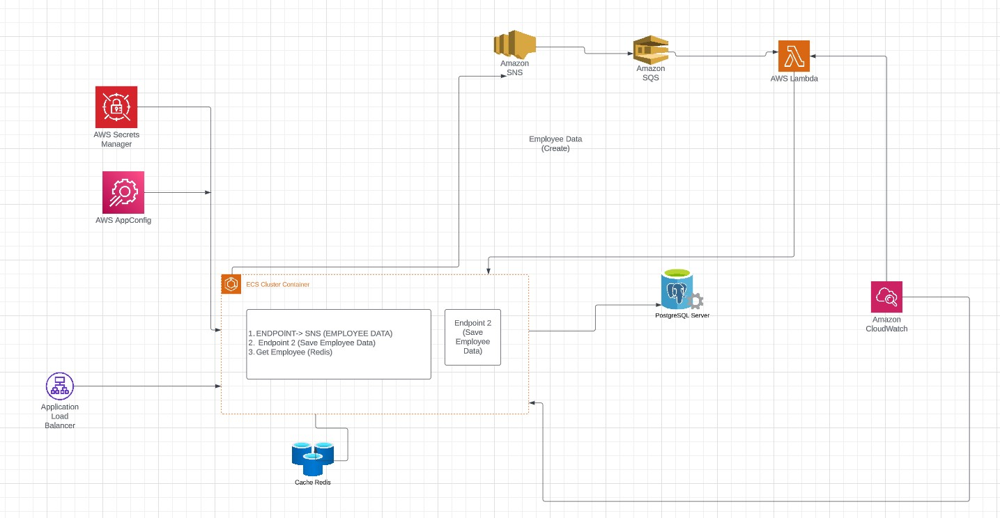

<h1>AWS Core</h1>

AWS core is a sample application that will consist of an API that is deployed in an ECS fargate cluster and will communicate with other aws services. This is a sample project just to get familiar with the different AWS services. The below image describes the workflow

<h2>Components and desired features</h2>
<ul>
  <li>
    We have an API that is deployed into an ECS fargate cluster. This api has an endpoint that pushes a message that contains information to 
    create a new employee to AWS SNS
  </li>
  <li>
    AWS SNS is connected to AWS SQS that will trigger a lambda function.
  </li>
  <li>The lambda will call another endpoint on the api hosted in ECS which will save the data to AWS RDS database</li>
  <li>The endpoint will be hooked up with secrets manager to retrieve secret keys and AWS Config Store to retrieve non confidential data</li>
  <li> WIll use cloudwatch to store logs, Create alerts based on metrics </li>
  <li> Understand IAM roles and Policies</li>
  <li>The API will also have an endpoint that uses redis cache to cache the data</li>
  <li>Use Amazon Cognito to add authentication for the API endpoints</li>
  <li> Create a CICD piplines using GITLAB and automate resource creation using Terraform</li>
</ul>
